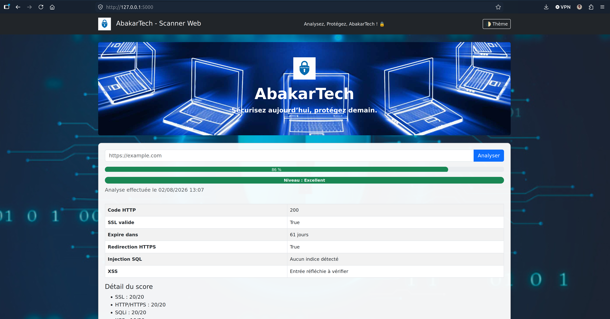
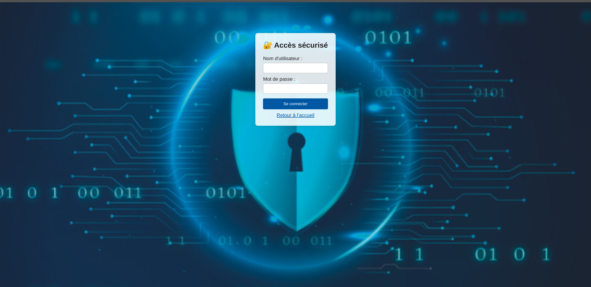

# SecuWeb

SecuWeb est une application Flask qui automatise plusieurs contrôles de
sécurité Web et produit un rapport PDF synthétique. Le projet a été développé
dans le cadre de mon apprentissage de Python, de Flask et de la cybersécurité
des applications Web.

> SecuWeb fournit des indicateurs techniques. Il ne remplace pas un audit de
> sécurité complet ni une validation manuelle.

## Fonctionnalités

- contrôle du certificat TLS et de sa date d'expiration ;
- vérification de la réponse HTTP et de la redirection vers HTTPS ;
- analyse des en-têtes de sécurité : CSP, HSTS, X-Frame-Options,
  X-Content-Type-Options et Referrer-Policy ;
- inspection des attributs `Secure`, `HttpOnly` et `SameSite` des cookies ;
- recherche heuristique de messages d'erreur pouvant indiquer une injection
  SQL ;
- détection d'une entrée réfléchie à examiner manuellement dans le cadre du
  contrôle XSS ;
- calcul d'un indice SecuWeb détaillé ;
- génération d'un rapport PDF avec graphiques et recommandations ;
- protection du téléchargement des rapports par authentification.

## Mesures de sécurité intégrées

- secrets chargés depuis un fichier `.env` exclu de Git ;
- mot de passe administrateur stocké sous forme de hash ;
- rapports isolés par session et supprimés après utilisation ;
- blocage des adresses locales, privées ou non routables afin de limiter les
  risques de SSRF ;
- validation de chaque redirection HTTP ;
- délais d'attente appliqués aux requêtes réseau ;
- mode debug désactivé et en-têtes HTTP de protection ajoutés par Flask.

## Technologies

- Python 3.10+
- Flask
- Requests
- Cryptography
- FPDF2
- Matplotlib
- python-dotenv
- Gunicorn

## Architecture

```text
SecuWeb/
├── app.py
├── scanner.py
├── requirements.txt
├── .env.example
├── templates/
│   ├── index.html
│   └── login.html
├── static/
├── screenshots/
└── README.md
```

Le répertoire `instance/reports/` est créé automatiquement pour les rapports
temporaires. Il ne doit pas être ajouté au dépôt.

## Installation

### 1. Cloner le projet

```bash
git clone https://github.com/cherif235/SecuWeb.git
```

### 2. Créer et activer l'environnement virtuel

```bash
python3 -m venv .venv
source .venv/bin/activate
```

Sous Windows PowerShell :

```powershell
py -m venv .venv
.venv\Scripts\Activate.ps1
```

### 3. Installer les dépendances

```bash
python -m pip install --upgrade pip
python -m pip install -r requirements.txt
```

### 4. Créer la configuration locale

```bash
cp .env.example .env
```

Générer une clé secrète :

```bash
python -c "import secrets; print(secrets.token_hex(32))"
```

Générer le hash du mot de passe administrateur sans afficher le mot de passe
dans l'historique du terminal :

```bash
python - <<'PY'
from getpass import getpass
from werkzeug.security import generate_password_hash

password = getpass("Mot de passe administrateur : ")
print(generate_password_hash(password))
PY
```

Copier les deux valeurs obtenues dans `.env` :

```dotenv
SECRET_KEY=votre_cle_secrete_aleatoire
ADMIN_USERNAME=admin
ADMIN_PASSWORD_HASH=votre_hash_complet
SESSION_COOKIE_SECURE=false
```

Le hash doit être copié en entier, y compris son préfixe, par exemple
`scrypt:`. Le fichier `.env` contient des secrets : ne le publiez jamais.

Pour une application servie uniquement en HTTPS, utilisez
`SESSION_COOKIE_SECURE=true`.

### 5. Vérifier et lancer l'application

```bash
python -m py_compile app.py scanner.py
python -m flask --app app run
```

Ouvrir ensuite <http://127.0.0.1:5000>.

## Utilisation

1. saisir l'URL publique d'un site que vous êtes autorisé à analyser ;
2. consulter les résultats et l'indice SecuWeb ;
3. demander le rapport PDF ;
4. s'authentifier avec l'identifiant et le mot de passe définis dans `.env` ;
5. télécharger le rapport généré.

## Limites connues

- une entrée réfléchie ne constitue pas, à elle seule, une faille XSS ;
- le contrôle SQL recherche uniquement certains messages d'erreur connus ;
- l'absence d'indice ne prouve pas l'absence de vulnérabilité ;
- certains attributs de cookies peuvent être indéterminés ;
- les adresses locales et privées sont volontairement refusées ;
- les résultats peuvent varier selon la disponibilité et la configuration du
  serveur distant.


## Aperçu

### Interface principale



### Résultats d'une analyse



## Auteur

**Abakar Tahir Cherif**

Titulaire d'une Licence Informatique et admis en Master of Science
Cybersécurité & Infrastructures Réseaux à Coda Orléans.